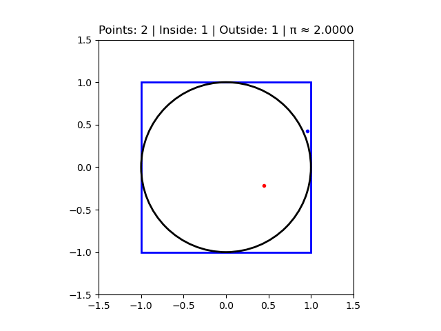

# 🎲 Monte Carlo Pi Estimation

This project demonstrates the **Monte Carlo method**—a statistical technique that uses random sampling to solve deterministic problems. 

## 🚀 How it Works
The simulation generates random points within a square and calculates the ratio of points that fall inside an inscribed circle.

$$\pi \approx 4 \times \frac{\text{Points Inside Circle}}{\text{Total Points}}$$

## 📊 Visualization

## 🛠️ Tech Stack
- **Python**
- **NumPy**: Vectorized calculations for high performance.
- **Matplotlib**: Frame-by-frame animation generation.
